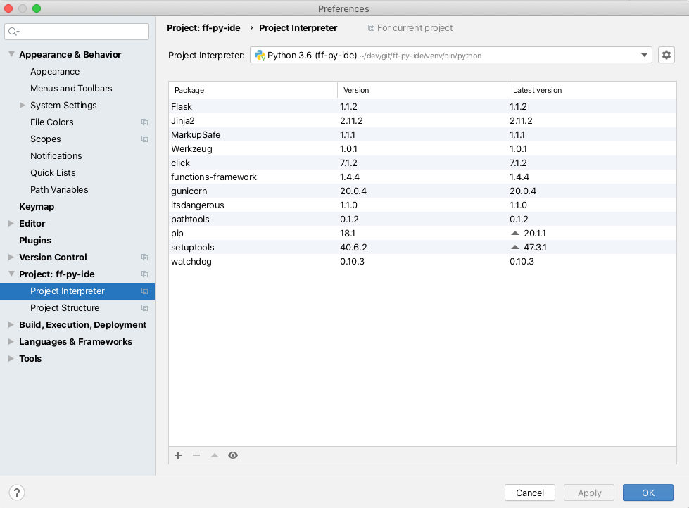

# Developing and Debugging Functions Framework code with PyCharm

You can create and debug local Functions Framework applications with PyCharm. 

Let's create a basic app.

```shell script
mkdir ff-py-ide
cd ff-py-ide

# Best to use a Virtual Env
python3 -m venv venv
source venv/bin/activate

pip install functions-framework
```

Now create a main.py file:

```python
def hello(request):
    return "Hello world!"
```

Open the **directory** with PyCharm. Make sure your project settings are using your venv:



Under Run > Configurations, create a new Python configuration as follows:


Set a breakpoint in `main.py` and run this configuration in Debug. You should see the server start and wait.
When you direct your browser to http://localhost:8080/, PyCharm should pause execution at the breakpoint.


